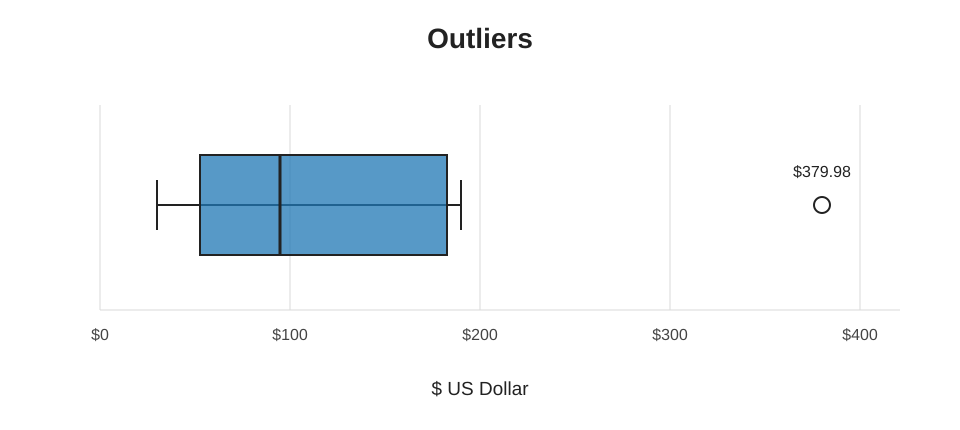
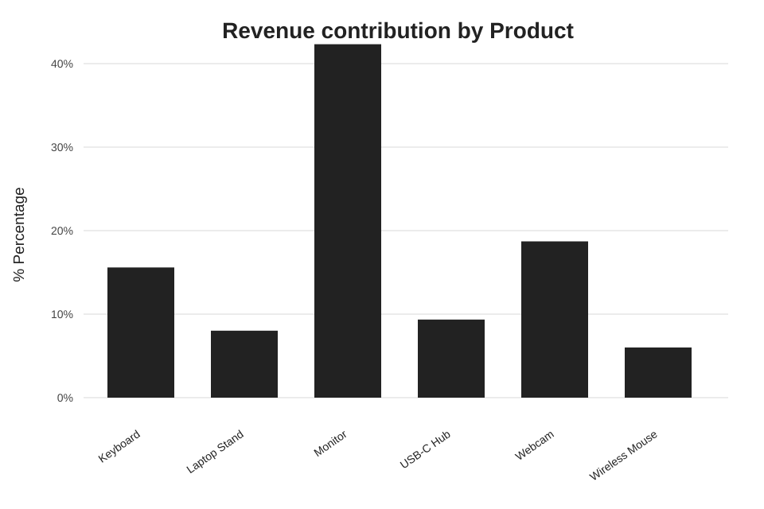

# Mini Sales Data Analysis Project

A beginner-friendly Python project that explores a small sales dataset with pandas, NumPy, and matplotlib.

## Analysis Questions and Answers

| Question | Answer |
| --- | --- |
| What is the total revenue? | **$2,244.60** |
| How many units were sold? | **39** |
| What is the best-selling product? | **Wireless Mouse** - 9 units sold overall; its largest individual order contains 4 units. |
| Which city generated the most revenue? | **Houston** with **$884.82**. |
| Is any data missing? | No; every column has 0 missing values. |
| Which sale is the highest-revenue order? | Order **1013**: a Monitor sale in Houston worth **$379.98**. |
| Which sale is the lowest-revenue order? | Order **1014**: a Wireless Mouse sale in Katy worth **$29.98**. |
| Are there revenue outliers? | Yes. Order **1013** ($379.98) is above the upper IQR fence and is identified as an outlier. |
| What is the average revenue per order? | **$112.23**. |

### Revenue by City

| City | Revenue |
| --- | ---: |
| Houston | $884.82 |
| Sugar Land | $779.91 |
| Katy | $579.87 |

### Product Revenue Contribution

| Product | Revenue share |
| --- | ---: |
| Monitor | 42.32% |
| Webcam | 18.71% |
| Keyboard | 15.59% |
| USB-C Hub | 9.35% |
| Laptop Stand | 8.02% |
| Wireless Mouse | 6.01% |

### Average Revenue by Product

| Product | Average revenue per order |
| --- | ---: |
| Monitor | $237.49 |
| Webcam | $139.98 |
| Keyboard | $87.48 |
| USB-C Hub | $69.98 |
| Laptop Stand | $59.98 |
| Wireless Mouse | $44.97 |

## Files

- `Project.py` - performs the analysis and creates the charts.
- `SQL.py` - runs SQLite queries against the local sales database.
- `mini_sales_project.csv` - source sales data.
- `mini_sales_project.db` - SQLite database containing the sales table.

## SQLite Query Findings

The SQLite database contains **20 sales records**. The following results come from the queries in `SQL.py`.

### Sales Records by Category

| Category | Sales records |
| --- | ---: |
| Accessories | 13 |
| Electronics | 7 |

### Average Revenue by City

| City | Average revenue |
| --- | ---: |
| Sugar Land | $129.99 |
| Houston | $126.40 |
| Katy | $82.84 |

### Revenue by Category

| Category | Total revenue |
| --- | ---: |
| Electronics | $1,369.88 |
| Accessories | $874.72 |

Electronics generated the most revenue despite having fewer sales records than Accessories.

## Libraries Required

- Python 3
- pandas
- NumPy
- matplotlib
- sqlite3 (included with standard Python)

Install the Python libraries with:

```bash
pip install pandas numpy matplotlib
```

Then run:

```bash
python Project.py
```

To run the SQLite queries:

```bash
python SQL.py
```

## Charts

### Revenue by Product


### Units Sold by Product


### Revenue by City


### Revenue Outliers



### Revenue Contribution by Product


