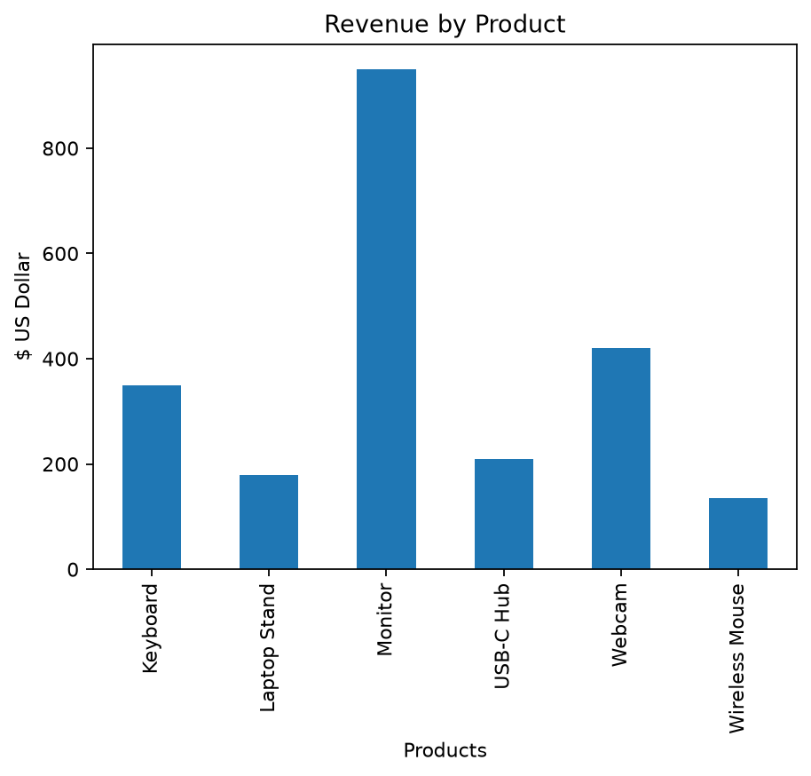
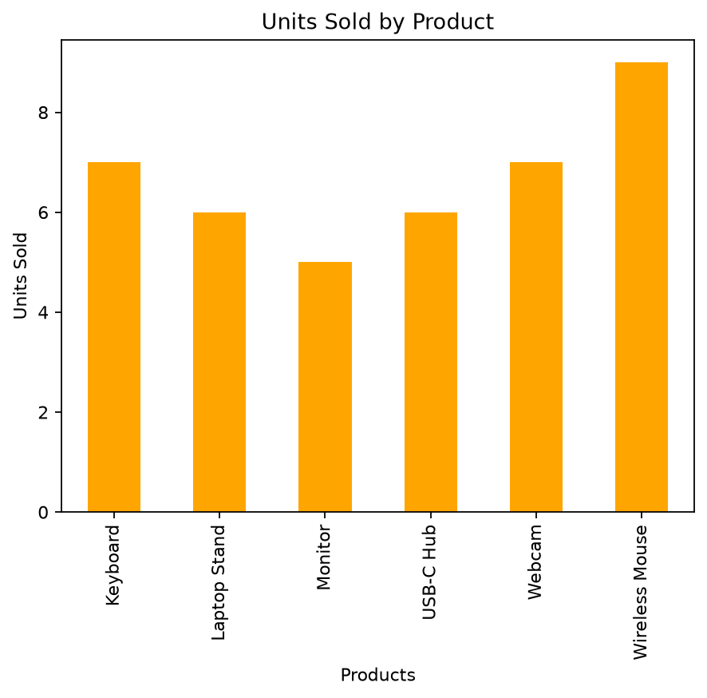
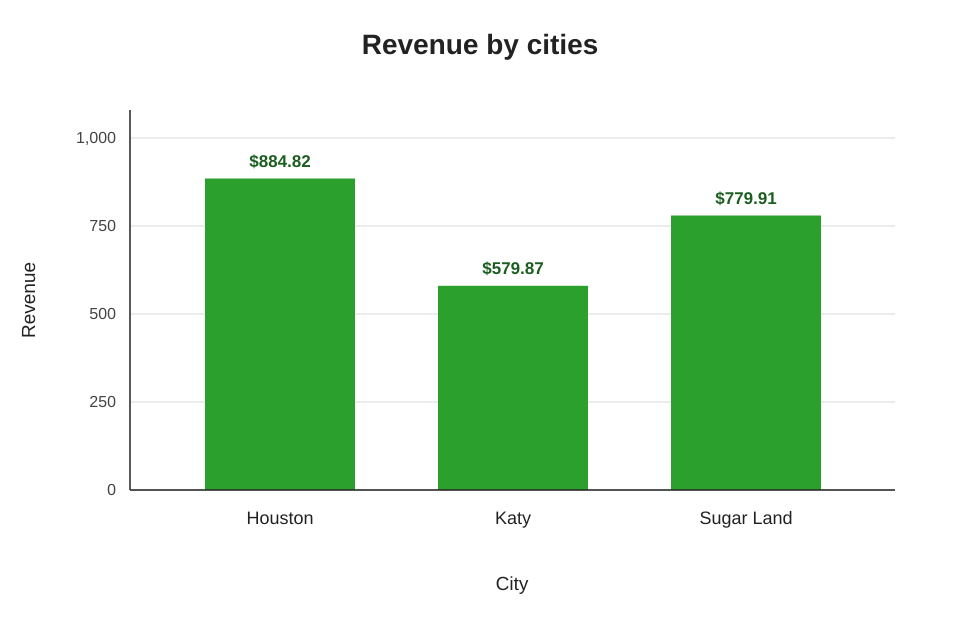

# Mini Sales Data Analyis Project

A beginner data-analysis project using Python, pandas, and matplotlib.

## Goal

Analyze a small sales dataset to find:
- Total revenue
- Total units sold
- Best-selling product
- Revenue by city
- Revenue and units sold by product
- Missing data

## Files

- `Project.py` — Python script that performs the analysis and creates charts.
- `mini_sales_project.csv` — sales dataset used by the script.

## Tools Used

- Python
- pandas
- matplotlib

## How to Run

1. Install the required libraries:

   ```bash
   
   pip install pandas matplotlib
   ```

## Charts






